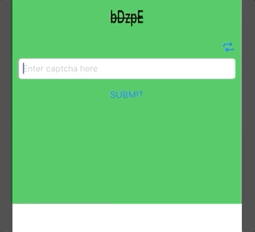

# CaptchaPod


[](https://travis-ci.org/Amr Hesham/CaptchaPod)
[](https://cocoapods.org/pods/CaptchaPod)
[](https://cocoapods.org/pods/CaptchaPod)
[](https://cocoapods.org/pods/CaptchaPod)

## Example

To run the example project, clone the repo, and run `pod install` from the Example directory first.

## Requirements

## Installation

CaptchaPod is available through [CocoaPods](https://cocoapods.org). To install
it, simply add the following line to your Podfile:

```ruby
pod 'CaptchaPod'
```

## Author

Amr Hesham, amr.hesham@fawry.com

## License

CaptchaPod is available under the MIT license. See the LICENSE file for more info.
